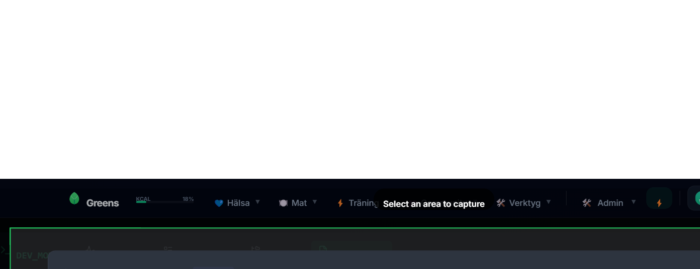

# BUG REPORT: Test
**Date**: 2026-01-11, 12:01:50
**Route**: `http://localhost:3000/developer/analysis`
**Image**: 

## User Description
Test

## Context
**Selection**: x=97, y=81 w=1392 h=537

### Potential Source Files
- [AnalysisPage.tsx](src\pages\AnalysisPage.tsx)
- [router.ts](src\api\router.ts)
- [App.tsx](src\App.tsx)

### Console Logs
```
[LOG] [Storage] Loaded data from API
[WARN] [Storage] Cloud has no recipes but local does. Merging.
[LOG] [Storage] Merging local goals with cloud goals
[LOG] [DataContext] Discarding stale load results
[LOG] [Storage] Loaded data from API
[WARN] [Storage] Cloud has no recipes but local does. Merging.
[LOG] [Storage] Merging local goals with cloud goals
[LOG] [DataContext] Fetching /api/users...
[LOG] [DataContext] Loaded real users list: ["jennie","testuser","pontus","wingerlang","testuserjetski_test_123","joel","JennieJ","admin"]
[LOG] [DataContext] Fetching /api/auth/me...
[LOG] [DataContext] Resolved current user: wingerlang
[LOG] [DataContext] Loaded strength workouts globally: 203
[LOG] Optimizing auto-save: Skipping API sync for atomic update
```

## AI Instructions
To fix this bug, analyze the image and description. The potential files linked above are the likely culprits.